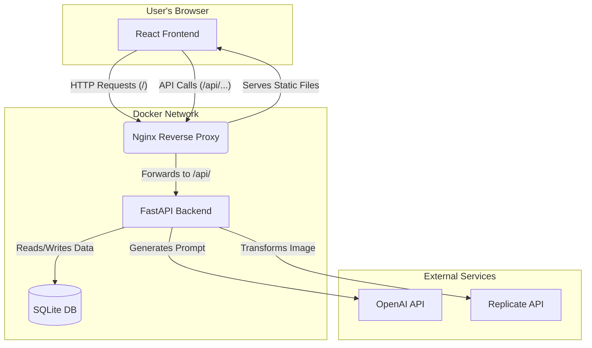

# 🚀 Almere 2075 - Interactive AI Exhibition App

Welcome to the Almere 2075 project! This application is an interactive, web-based experience designed for an exhibition setting. It brings to life the speculative urban design work of Bauhaus-Universität Weimar students, who reimagined the city of Almere, Netherlands, for the year 2075.

The app allows visitors to select a contemporary photograph, choose from a palette of futuristic concepts, and use AI to transform the image into a compelling vision of Almere. These transformations are guided by detailed concepts developed by students to address future challenges like flood resilience and resource scarcity.

---

### ✨ Key Features

*   **Interactive AI Transformation:** Select an image from the gallery or upload your own, pick from core design concepts like 'Flood Defense' or 'Farm Towers', and watch as AI generates a unique, futuristic vision.
*   **Dynamic 3D Gallery:** Explore source images in a full-screen, dynamic WebGL grid that reacts to your mouse movements.
*   **Community Gallery & Voting:** Browse all user-created transformations in a public gallery. Vote for your favorites and help shape Almere's future!
*   **Gamification - The Almere Happiness Score:** Every vote contributes to a city-wide "Happiness Score." Help us reach the goal of **1000 Happy Points** by **midnight on July 13th**!
*   **Dual Comparison View:** The final transformed image is displayed alongside the original in two modes:
    *   **Side-by-Side:** A static comparison of the "before" and "after".
    *   **Interactive Slider:** A draggable slider to dynamically reveal the transformation.
*   **Generated Prompt Display:** See the exact, detailed prompt that was generated by the "Cinematic Architect" AI to guide the image model.
*   **Detailed Process Logging:** A "liquid glass" style log panel appears during processing, showing the step-by-step communication with the AI backend.

---

### 🏛️ Architecture and Data Flow

The application is a containerized, multi-service system orchestrated by Docker Compose. A central Nginx reverse proxy routes traffic to the appropriate service, enabling a seamless single-origin experience for the user.

#### System Architecture Diagram



#### Typical User Transformation Flow

1.  **Image Selection:** The user selects an image in the React frontend.
2.  **Prompt Generation:** The frontend sends the image (as a Data URL) and selected concept tags to the `/api/generate-prompt` endpoint.
3.  **AI Architect:** The FastAPI backend receives the request and calls the OpenAI API (`gpt-4.1-mini`) with a detailed system prompt, asking it to generate a creative instruction for the image model.
4.  **Image Transformation Job:** The frontend sends the original image, the generated prompt, and the selected tags to the `/api/transform-image` endpoint.
5.  **Database Record:** The backend creates a new `Generation` record in the SQLite database with a `pending` status and returns a unique `job_id`.
6.  **Background Task:** The backend immediately starts a background task, sending the image and prompt to the Replicate API to run the `flux-kontext-pro` model.
7.  **Polling for Status:** The frontend continuously polls the `/api/job-status/{job_id}` endpoint.
8.  **Completion:** Once the Replicate job is finished, the backend task downloads the generated image, saves it locally, updates the database record to `completed` with the new image URL.
9.  **Display Result:** On the next poll, the frontend receives the `completed` status and the final image URL, displaying it in the comparison view.

---

### 💻 Tech Stack

*   **Frontend:**
    *   **Framework:** React with Vite
    *   **Language:** TypeScript
    *   **State Management:** Zustand
    *   **3D/WebGL:** `react-three-fiber`
*   **Backend:**
    *   **Framework:** FastAPI
    *   **Language:** Python 3.10
    *   **ORM:** SQLAlchemy
*   **Database:**
    *   SQLite (for simplicity and portability in an exhibition setting)
*   **AI Models:**
    *   **Prompt Generation:** OpenAI `gpt-4.1-mini`
    *   **Image Transformation:** `black-forest-labs/flux-kontext-dev` via Replicate API
*   **Infrastructure & Deployment:**
    *   **Containerization:** Docker & Docker Compose
    *   **Reverse Proxy:** Nginx

---

### ▶️ Getting Started

Follow these instructions to get the application running on your local machine.

#### 1. Prerequisites

*   You must have **Docker** and **Docker Compose** installed on your system.

#### 2. Configuration

The application requires API keys for OpenAI and Replicate.

*   First, copy the example environment file. This file is ignored by Git and should never be committed.
    ```bash
    cp .env.example .env
    ```

*   Next, open the new `.env` file with a text editor and add your actual API keys and configuration.
    ```env
    # Almere 2075 App Environment Variables

    # --- REQUIRED: Backend API Keys ---
    OPENAI_API_KEY="sk-..."
    REPLICATE_API_KEY="r8_..."

    # --- OPTIONAL: Deployment & Docker Settings ---
    # The base URL of the application, used for constructing image URLs if needed
    APP_URL="http://localhost:2075"
    # The external port mapping for Nginx
    NGINX_HOST_PORT=2075
    ```

#### 3. Add Example Images

*   Place your source images (e.g., `.jpg`, `.png`) inside the `./backend/images/` directory. The application will use these to populate the initial gallery.
*   Thumbnails are generated automatically on the first run.

#### 4. Run the Application

The project includes separate configurations for development (with hot-reloading) and production.

*   **For Development:**
    This mode enables automatic reloading when you change a file in either the frontend or backend.
    ```bash
    docker-compose -f docker-compose.dev.yml up --build
    ```

*   **For Production:**
    This command builds optimized containers for deployment.
    ```bash
    docker-compose up --build
    ```

#### 5. Access the App

*   Once the containers are running, open your web browser and navigate to:
    **[http://localhost:2075](http://localhost:2075)**
*   To test on other devices (like a phone or tablet) on your local network, find your computer's local IP address (e.g., `192.168.1.100`) and access the app at `http://<YOUR_IP_ADDRESS>:2075`.

---

### 📂 Project Structure

```
almere-2075/
├── .env                  # Local secrets and config (ignored by git)
├── .env.example          # Example environment file
├── docker-compose.yml    # Production services definition
├── docker-compose.dev.yml# Development services with hot-reloading
│
├── backend/
│   ├── Dockerfile            # Production Docker build for backend
│   ├── Dockerfile.dev        # Development Docker build
│   ├── requirements.txt      # Python dependencies
│   ├── app/                  # FastAPI application source
│   │   ├── main.py           # Main app, routes, and logic
│   │   ├── database.py       # Database connection setup
│   │   ├── db_models.py      # SQLAlchemy table models
│   │   └── models.py         # Pydantic data models (API request/response)
│   └── images/               # Source and generated images are stored here
│
├── frontend/
│   ├── Dockerfile            # Production Docker build (multi-stage)
│   ├── Dockerfile.dev        # Development Docker build
│   ├── package.json          # Node dependencies
│   ├── tsconfig.json         # TypeScript configuration
│   ├── vite.config.ts        # Vite build tool configuration
│   └── src/                  # React/TypeScript source code
│       ├── main.tsx          # App entry point
│       ├── App.tsx           # Main App component
│       ├── store.ts          # Zustand global state store
│       ├── hooks/            # Custom hooks (e.g., useAppLogic.ts)
│       ├── components/       # Reusable UI components
│       └── views/            # Major page/view components
│
└── nginx/
    ├── nginx.conf            # Production Nginx configuration
    └── nginx.dev.conf        # Development Nginx configuration
```

---

### Credits

This project is based on the "Almere 2075" studio work from the **Informatics in Architecture and Urbanism** chair at **Bauhaus-Universität Weimar**.
*   **Contact:** Prof. Dr. Reinhard König